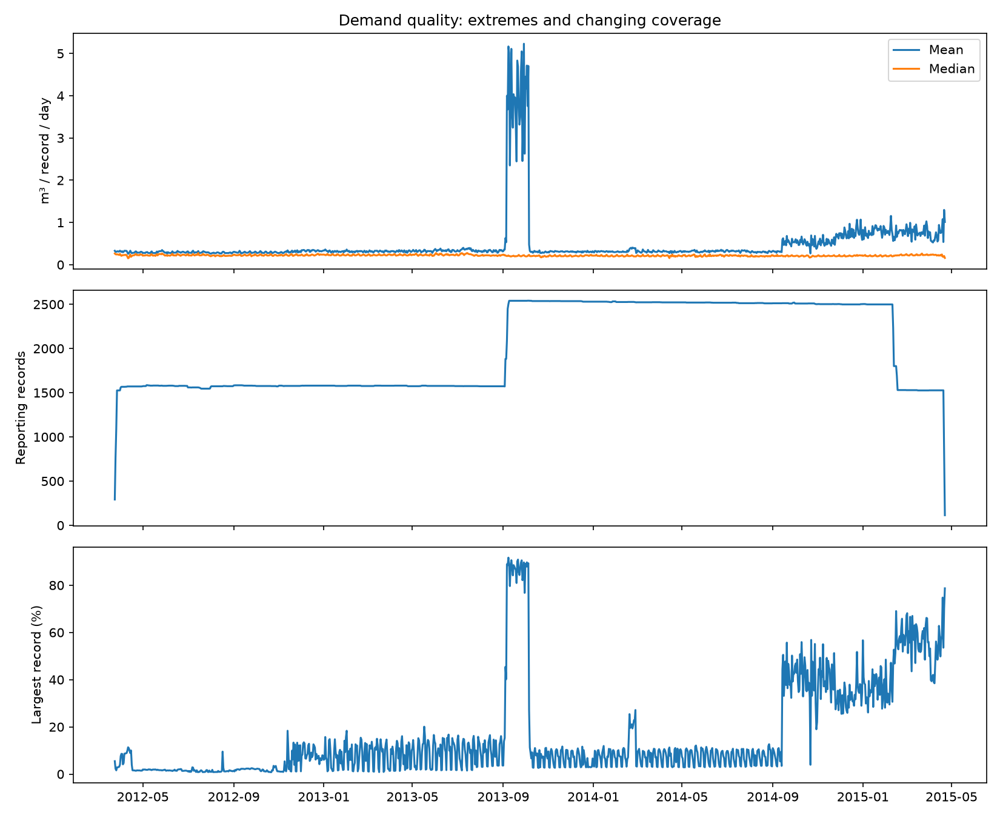

# Yorkshire water demand and weather: final portfolio report

Completed 3 October 2026. This is a retrospective forecasting case study, not a production water-supply forecast.

Follow-up: [prior-day information and nested selection](MODELLING_FOLLOWUP.md) tests whether bounded model improvements generalise. It also clarifies that the weather gains below use same-day observations; prior-day weather does not reproduce the strongest gain.

## Main finding

Weather adds small, inconsistent improvements after demand history and calendar effects are included. The evidence does not support a general claim that these regional observed-weather features reliably improve daily water-demand predictions. Careful definition of the target and meter population matters more than selecting a more complex model in this dataset.

## Data and preparation

The Yorkshire Water local-area dataset contains 2,596 meter records for 2,160 anonymised properties and 1,125 consecutive dates, 24 March 2012–22 April 2015. It includes internal and external meters in two anonymised distribution management areas. Daily regional rainfall and maximum/minimum temperatures come from Met Office HadUK-Grid v1.3.2.ceda, release v20260512, selecting the Yorkshire and Humber region by metadata label.

The demand table is reshaped and nonnumeric/missing readings excluded. Five negative readings are treated as missing. Other extreme readings are retained in the principal analysis. An ISO weather-date parsing defect discovered during review was corrected and regression-tested; early scores produced before that correction are superseded.

435 properties have multiple records. Consequently, mean demand is per observed meter record, not per household. A daily median describes a typical observed meter and is a different target from mean consumption; lower median-target errors cannot be treated as improvements on the mean-target task.

Area 1 external meters report from 4 September 2013–11 February 2015 and internal meters through 16 February 2015. Area 2 spans almost the entire study. Pooling areas therefore changes the population over time. Final comparisons separate both area and meter location.

## Quality findings

One external record reaches 11,910 m³ on 29 September 2013 and supplies 89.65% of total observed consumption on the peak-mean day. Other records also have large extremes. The source catalogue specifies cubic metres but does not explain these records. Their origin remains unresolved; no correction factor, deletion or winsorisation is applied to the final analysis.

Coverage ranges from 114 to 2,541 records per day in the pooled data. Only two records are complete over the full study. A full-period balanced panel would therefore be unrepresentative. Internal/external segmentation avoids some composition changes, but does not guarantee a fixed set of reporting meters within each group.

## Evaluation design

Each area/location is modelled with both mean and median targets. Four fixed approaches are compared: yesterday's observed target, the observed target seven days earlier, Ridge using calendar and demand-history features, and the same Ridge with weather added. Ridge alpha remains 10; there is no hyperparameter search.

Demand history comprises 1-, 7- and 14-day lags and a shifted 7-day mean. Calendar features are weekday, weekend and annual sine/cosine. Weather features are daily maximum/minimum/mean temperature, rainfall, 3-/7-day mean temperature and 3-/7-day rainfall totals. Imputation and scaling are fitted only on the training block.

After the initial 14-day lag warm-up, expanding training windows contain at least 365 days. Evaluation uses the latest nonoverlapping 90-day blocks, up to six. Area 1 permits only one block per meter type; Area 2 permits six. Area 1 external testing spans 14 November 2014–11 February 2015; internal spans 19 November 2014–16 February 2015. Area 2 external blocks span 29 October 2013–21 April 2015; internal blocks span 30 October 2013–22 April 2015.

These are sequential daily predictions using observed demand up to the previous day, with fixed fitted models within each block. They are not 90-day forecasts issued at one origin. Same-day observed weather is used; operational deployment would require weather forecasts available at issue time. Region-level weather is a proxy because precise DMA locations are anonymised.

## Final results

Values are average 90-day block MAE in m³ per observed meter record per day. Negative weather change indicates improvement relative to Ridge without weather. Compare models within each row, not errors across different targets or populations.

| Area / meters / target | Yesterday | Weekly | Ridge without weather | Ridge with weather | Weather MAE change |
|---|---:|---:|---:|---:|---:|
| 1 / external / mean | 0.214285 | 0.258292 | 0.206674 | 0.225855 | +9.28% |
| 1 / external / median | 0.010294 | 0.008139 | 0.006209 | 0.006395 | +2.99% |
| 1 / internal / mean | 0.011751 | 0.009745 | 0.009090 | 0.009113 | +0.25% |
| 1 / internal / median | 0.011361 | 0.008544 | 0.008236 | 0.008380 | +1.74% |
| 2 / external / mean | 0.078540 | 0.075385 | 0.060778 | 0.060316 | −0.76% |
| 2 / external / median | 0.012144 | 0.009057 | 0.007513 | 0.007261 | −3.36% |
| 2 / internal / mean | 0.117355 | 0.056498 | 0.064972 | 0.065222 | +0.38% |
| 2 / internal / median | 0.010573 | 0.010651 | 0.008251 | 0.008188 | −0.76% |

The strongest weather improvement is 3.36% for Area 2 external median consumption. The Area 2 external mean improvement is below 1%. No significance claim is made, and several alternatives have been examined during exploratory development. These are descriptive validation results, not an untouched final confirmation set.

A secondary coverage check excludes evaluation days reporting below 90% of the training median count. It excludes one day per area/location target across the evaluated periods; it does not alter training or recompute lag features. Weather-change directions remain unchanged. For Area 2 external median, the improvement becomes 3.19%. This limited check does not establish that all remaining days are free from coverage bias.

## Why gradient boosting was not advanced

In the earlier six-block pooled analysis its average MAE was 0.391128, versus 0.056021 for yesterday's value. Excluding the largest record in a retrospective sensitivity scenario reduced its MAE to 0.063694. This supports sensitivity to the extreme training record, but the exclusion is not a validated cleaning rule. Gradient boosting was retained in the audit and was not tuned or included in the final segmented comparison. No claim is made that it could never work on appropriately verified data.

## Conclusion and limits

This project demonstrates data acquisition, regional NetCDF extraction, quality diagnosis, leakage-aware demand features, chronological evaluation and transparent negative findings. The appropriate conclusion is modest: weather contributes little consistent incremental value for these fixed models and targets, while anomalies and population changes materially affect results.

Further operational work would require resolving source anomalies, documenting meter relationships, specifying a consistent target population and supplying forecast weather. More complex modelling is optional future work, not needed to complete this portfolio case study.

## Reproducibility and attribution

See [README](README.md) for the one-command workflow and [data sources](DATA_SOURCES.md) for acquisition. `outputs/final/` contains per-fold metrics, predictions, coverage flags, a summary chart and input SHA-256 hashes. The original pooled outputs and audit reports are retained for traceability. Source data are excluded from the shareable archive.

Demand attribution: Yorkshire Water via [Data Mill North](https://datamillnorth.org/dataset/daily-customer-meter-data-local-area-study-2y1yy), Creative Commons Attribution as shown by the catalogue. Weather attribution: Met Office HadUK-Grid via CEDA, Open Government Licence as documented in the acquisition notes. Raw data were transformed into aggregate analytical results; no publisher endorsement is implied.
