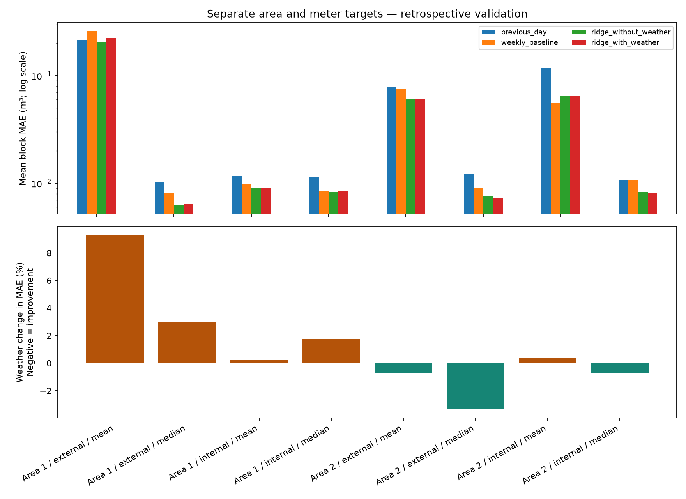

# Yorkshire Water Demand Forecasting

### Exploring whether regional weather improves daily consumption predictions

A reproducible Python case study combining Yorkshire Water meter observations with Met Office HadUK-Grid weather data.

The central question is:

> Can weather improve daily water-demand predictions beyond recent consumption and calendar patterns?

## Main result

Weather provides **small and inconsistent improvements**. The largest improvement in the main comparison is a **3.36% reduction in MAE** for Area 2 external-meter median consumption. That result uses same-day observed weather, so it is retrospective rather than an operational day-ahead result.

The analysis also finds that unusual readings and changing meter participation affect the results more strongly than model choice. Simple demand-history baselines remain important reference points.

| Area / meters / target | History-only Ridge MAE | Ridge with weather MAE | Weather change |
|---|---:|---:|---:|
| Area 1 / external / mean | 0.2067 | 0.2259 | +9.28% |
| Area 1 / external / median | 0.0062 | 0.0064 | +2.99% |
| Area 1 / internal / mean | 0.0091 | 0.0091 | +0.25% |
| Area 1 / internal / median | 0.0082 | 0.0084 | +1.74% |
| Area 2 / external / mean | 0.0608 | 0.0603 | −0.76% |
| Area 2 / external / median | 0.0075 | 0.0073 | −3.36% |
| Area 2 / internal / mean | 0.0650 | 0.0652 | +0.38% |
| Area 2 / internal / median | 0.0083 | 0.0082 | −0.76% |

MAE is measured in cubic metres per observed meter record per day. Compare models within the same target and population; mean and median consumption are different prediction tasks.



## Visual report

1. [Predictions versus observations, with daily errors](outputs/visual_report/01_forecast_story.png)
2. [Weather’s effect across separate test periods](outputs/visual_report/02_weather_consistency.png)
3. [How forecast errors accumulate](outputs/visual_report/03_error_accumulation.png)
4. [Changes in reporting meter coverage](outputs/visual_report/04_coverage_story.png)
5. [Temperature and consumption relationships](outputs/visual_report/05_weather_relationship.png)

## Data

The demand source contains **2,596 meter records for 2,160 anonymised properties** across two anonymised distribution management areas, covering March 2012 to April 2015. It includes internal and external meters.

The weather source is Met Office HadUK-Grid v1.3.2.ceda. The project extracts regional daily rainfall and maximum/minimum temperature for Yorkshire and Humber.

The demand data has substantial missingness and changing participation. One record reaches 11,910 m³ and contributes nearly 90% of total consumption on the highest-demand day. The source catalogue confirms cubic metres but does not explain this record, so extreme observations remain in the principal analysis rather than being silently removed.

See [DATA_SOURCES.md](DATA_SOURCES.md) for acquisition and attribution details.

## Modelling approach

The main comparison uses:

- Previous-day consumption
- Consumption seven days earlier
- Ridge regression with calendar and demand-history features
- Ridge regression with calendar, demand-history and weather features

Demand-history features use 1-, 7- and 14-day lags plus a shifted seven-day mean. Weather features include temperature, rainfall and short rolling weather summaries. The feature builder rejects duplicate or missing calendar dates so daily lags cannot silently refer to the wrong period.

Validation is chronological, with expanding training windows and nonoverlapping 90-day test blocks. Area 2 supports six blocks; Area 1 has only one block for each meter type because its reporting period is shorter.

The follow-up experiment in [MODELLING_FOLLOWUP.md](MODELLING_FOLLOWUP.md) tests prior-day-only weather and bounded model selection. It is included for transparency; it does not replace the simpler main comparison because the extra complexity does not improve every population consistently.

## Getting started

Tested locally with Python 3.14 on Windows. From this project directory:

```powershell
python -m venv .venv
.\.venv\Scripts\python.exe -m pip install -r requirements.txt
```

Obtain the three HadUK-Grid NetCDF files described in [DATA_SOURCES.md](DATA_SOURCES.md) and place them in `data/raw/weather/netcdf/`. Then run:

```powershell
.\.venv\Scripts\python.exe run_real_data.py
```

The runner reuses existing raw files, prepares the regional weather table, runs the tests, regenerates the analyses and creates the visual report. If the files are absent, the demand downloader runs automatically; automated CEDA downloads require an authorised account and a locally configured `CEDA_TOKEN`.

To regenerate only the visual report after analysis:

```powershell
.\.venv\Scripts\python.exe create_visual_report.py
```

## Project structure

```text
├── README.md
├── FINAL_REPORT.md
├── MODELLING_FOLLOWUP.md
├── DATA_SOURCES.md
├── requirements.txt
├── requirements-lock.txt
├── run_real_data.py
├── run_pipeline.py
├── final_analysis.py
├── improve_models.py
├── review_validation.py
├── review_coverage.py
├── create_visual_report.py
├── src/
├── tests/
├── data/
└── outputs/
    ├── final/
    ├── improved/
    ├── validation_review/
    └── visual_report/
```

## Verification

The latest complete workflow passes **eight tests** covering demand aggregation, date parsing, leakage-safe features, weather extraction, model execution and chronological evaluation windows.

Two local NetCDF dependency warnings are documented; they do not prevent successful extraction or analysis.

## Limitations

- The precise DMA locations are anonymised, so regional weather is only an area-level proxy.
- The reporting meter population changes over time.
- Mean consumption per meter record is not household consumption or total DMA demand.
- Several unusually large readings remain unexplained.
- Same-day observed weather is suitable for retrospective development, but an operational forecast would require weather forecasts available at issue time.
- The historical evaluation periods were examined during development and are not an untouched confirmation set.

## Reports and attribution

Read [FINAL_REPORT.md](FINAL_REPORT.md) for the full analysis and [MODELLING_FOLLOWUP.md](MODELLING_FOLLOWUP.md) for the information-timing and model-selection follow-up.

Demand data: Yorkshire Water, distributed through [Data Mill North](https://datamillnorth.org/dataset/daily-customer-meter-data-local-area-study-2y1yy), under the catalogue’s Creative Commons Attribution terms.

Weather data: Met Office HadUK-Grid, accessed through CEDA. See [DATA_SOURCES.md](DATA_SOURCES.md) for the documented source and licence details.

Raw datasets, virtual environments, caches and credentials are excluded from the source archive. No software licence has been selected yet.

